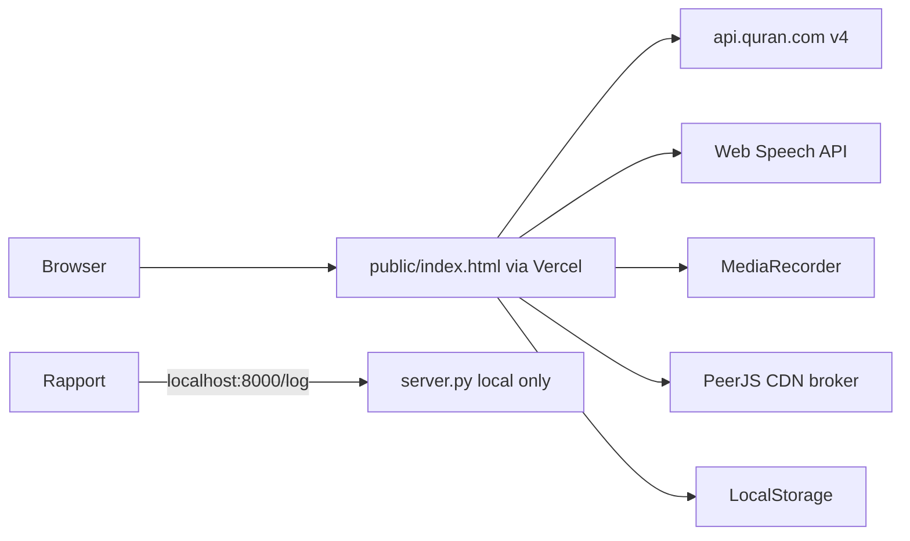

# Analyse production Tilmidh (A→Z)

**Date :** 2026-08-10 (màj marque 2026-08-12)  
**URL analysée :** https://tilmidh.app/  
**Outils :** agent-reach (`doctor --json`) — web = **Jina Reader** ; GitHub = **gh CLI**  
**Repo :** https://github.com/alkhastvatsaev/tilmidh

---

## 1. Ce que la prod sert vraiment

| Signal | Observation |
|--------|-------------|
| HTTP | `200`, `content-type: text/html`, `content-length: **137090**` |
| Cache | `x-vercel-cache: HIT` |
| Titre | `Tilmidh تلميذ` |
| Stack runtime | **1 seul fichier HTML/JS** + PeerJS CDN `1.5.0` + Google Fonts |
| Framework | **Pas** de Next (`next-size-adjust` absent) |

Sur GitHub, `public/index.html` fait ≈ **137090** octets — **même taille** que la réponse prod.

`vercel.json` sur `main` :

```json
{
  "version": 2,
  "cleanUrls": true,
  "rewrites": [{ "source": "/(.*)", "destination": "/index.html" }]
}
```

**Verdict :** la production = SPA legacy static (`public/index.html`), **pas** l’app Next.js dans `src/`.

---

## 2. Query `?ref=41:1` — constat critique

- API Quran OK : `41:1` = sourate **Fussilat** (فصلت), 1 mot.
- Jina Reader sur l’URL avec `ref=41:1` expose le contenu d’**Al-Fātiḥah** (بسم… الحمد…), pas Fussilat.

Dans `public/index.html`, au `DOMContentLoaded` :

- charge les sourates `112`, `113`, `114`, puis `1` (Fātiḥah active en dernier) ;
- **aucun** `URLSearchParams` / `location.search` / lecture de `?ref=`.

**Verdict :** le query `?ref=41:1` est **ignoré** par la prod actuelle.  
(Le paramètre `ref` est géré dans le code Next `src/`, non déployé en prod.)

---

## 3. UI / features relevées (page live + HTML)

Présents et câblés dans le monolite :

- i18n FR / EN / RU
- Overlay « Touchez pour commencer » + Verset du jour + Mode Duo
- Browser Al-Quran + **IA Import** (label UI) → données via `api.quran.com`
- Tableau de bord (versets / favoris / objectif Coran %)
- Analyse live « Cible » / « Vous dites »
- Rapport technique + modale d’explication des règles Tajwid
- Bouton « Télécharger ma récitation » (présent dans le DOM)

**État client :**

- `localStorage` : `tajwid_lang`, `tajwid_favorites`, `tajwid_completed`
- Pas de base de données côté prod pour ces features

---

## 4. Flux runtime (prod)



---

## 5. GitHub — état du repo (au moment de l’analyse)

| Item | État |
|------|------|
| Default branch | `main` |
| Dernier commit `main` | `339f3b6` — Rollback production to legacy static SPA |
| PR #1 Next PWA | MERGED, puis rollback |
| Branche `stabilize/legacy-prod` | Poussée (fix download + `server.py` + docs) — **pas encore sur prod** |
| CI récente | Success sur le rollback |

---

## 6. Écarts / risques (faits observés)

1. **`?ref=` mort en prod** — les deep links du type `/?ref=41:1` ne chargent pas le verset demandé.
2. **Téléchargement** : sur `main`/prod, CSS `#download-btn { display: none !important }` + pas d’ajout de `.visible` dans `finishVerse()` ; correctif uniquement sur `stabilize/legacy-prod`.
3. **« IA Import »** = appel Quran.com, **pas** d’API IA (OpenAI, etc.).
4. **Mode Duo** : PeerJS avec IDs fixes `vatsaev-tilmidh-user1` / `user2`.
5. **Double codebase** (`public/` legacy vs `src/` Next) — risque de redeploy de la mauvaise stack.
6. **Rapport technique** vers `http://localhost:8000/log` : no-op en production (normal ; utile seulement avec `server.py` en local).

---

## 7. Synthèse

La page https://tilmidh.app/?ref=41%3A1 charge bien l’app legacy complète, mais **pas le verset 41:1**. Le démarrage force Al-Fātiḥah (+ sourates 112–114). Pour ouvrir Fussilat 41:1 aujourd’hui : import manuel ou browser de sourate dans l’UI.

Agent Reach au moment de l’analyse : **v1.5.0** (à jour).

---

## Suite possible (non exécutée ici)

1. Merger / déployer `stabilize/legacy-prod` (téléchargement + docs + `server.py`).
2. Ajouter le support de `?ref=` dans le legacy `public/index.html`.
3. Autre priorité à définir.
