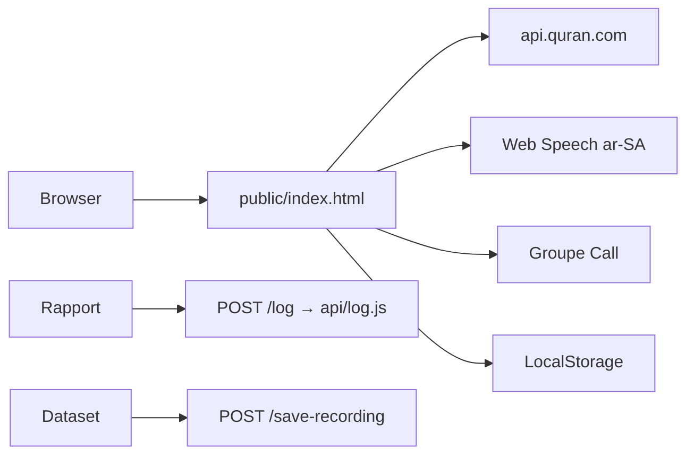

# Analyse production Tilmidh (A→Z)

**Date :** 2026-08-13 (branche `ship/audit-fixes-2026-08`)  
**URL :** https://tilmidh.app/  
**Repo :** https://github.com/alkhastvatsaev/tilmidh

---

## 1. Ce que la prod sert

| Signal | Observation |
|--------|-------------|
| Fichier live | `public/index.html` monolite (~340 KB) |
| Deploy | Vercel static + rewrites SPA + routes `api/*` |
| STT | Web Speech `ar-SA` (pas Whisper en continu) |
| Texte | `api.quran.com/v4` + `text_uthmani_tajweed` |
| Next `src/` | **Non déployé** |

`vercel.json` : rewrite catch-all SPA + `/log` → `/api/log`, `/save-recording` → `/api/save-recording`.

---

## 2. Correctifs audit (2026-08-13)

| Item | État |
|------|------|
| `FATIHA_ONLY` | `false` — import, browser, `?ref=`, verset du jour OK |
| Overlay start | Visible ; micro via click overlay (plus de `armMicOnFirstGesture`) |
| Thème | `localStorage.tajwid_theme` respecté |
| UI cachée CSS | Retiré (download, rapport, Voice Lab, thème, profil…) |
| STT Firefox/iOS | Message overlay si pas de Web Speech |
| Transliteration API | Garde `mapApiWord` |
| Modale tajweed | Mapping idgham/iqlab/laam_shamsiyah corrigé |
| Meta/OG | Plus de claim Ikhlāṣ-only / Duo imam |
| Stats | % basé sur ayahs en bibliothèque (plus 6236 fixe) |
| Offline | Cache session + Al-Fātiḥah embarquée |
| a11y zoom | `user-scalable=no` retiré ; `dir="auto"` |
| POST /log Vercel | `api/log.js` actif |
| `server.py` | Fallback stdlib si FastAPI absent |
| Docs | APP-MAP + ANALYSE-PROD à jour |

---

## 3. `?ref=` — comportement actuel

Au `DOMContentLoaded`, après boot 112/113/114/1 :

```js
const ref = new URLSearchParams(location.search).get('ref');
if (ref) await fetchVerseFromAPI(ref);
```

**Verdict :** deep links `/?ref=41:1` chargent le verset demandé (si API joignable).

---

## 4. Flux runtime



---

## 5. Risques résiduels

1. **Web Speech** absent sur Firefox desktop et Chrome iOS → entraînement micro impossible (message affiché).
2. **Groupe Call** : nécessite env LiveKit + `ROOM_PEPPER` en prod ; HMAC fallback dev seulement.
3. **Whisper** : code mort partiel (juge post-ayah optionnel) — pas le moteur live.
4. **Double codebase** `public/` vs `src/` — ne pas redeployer Next par erreur.

---

## 6. Test plan post-deploy

1. `/?ref=1:1` → Fātiḥah 1:1 active.
2. Overlay → micro Safari/Chrome Android.
3. Import sourate 2 → pas de doublon au re-clic.
4. Stats : % cohérent avec sourates chargées.
5. Rapport diagnostic → 200 sur `/log`.
6. Mode avion → Al-Fātiḥah embarquée au boot.
